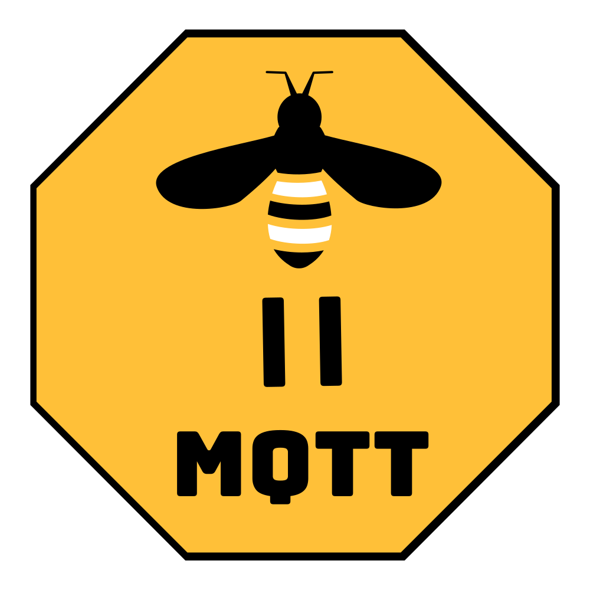

# <!-- fit --> La domotique sans les pièges du cloud

---

## Domotique

* Pour controller    

* Pour capter/mesurer    

* Pour automatiser/sécuriser
  - fermer automatiquement les volets quand la nuit tombe
  - allumer/éteindre automatiquement les lampes d'un couloir quand un mouvement est détecté
  - avertir qu'une porte/fenêtre est ouverte quand je quitte la maison ...

---

## Probléme

De nos jours, les vendeurs de solutions IoT proposent des produits qui utilisent systématiquement le cloud pour le traitement des données.
Cela représente évidement un risque pour nos données personelles.

---
Scénario classique

---

## Solutions

Il existe des solutions open source pour atteindre le même résultat.
Cependant, cela necessite de recourir à l'auto hébergement.
_(mais c'est facile avec une raspberrypi )_

---

Scénario en autohébergement

---

## Cas concret

Piloter des objets zigbee à partir de logiciels opensource.

--- 

## Mise en oeuvre

* Radio : USB stick with zStack firmware (Texas Instruments CC2531)
* Bridge : Zigbee2MQTT, assure la liaison entre le réseau ZigBee et le serveur MQTT
* Bus MQTT : Mosquitto, une implémentation opensource d'un broker MQTT
* Serveur domotique : Homeassistant

---

_from wikipedia.org_
>ZigBee est un protocole de haut niveau permettant la communication d'équipements personnels ou domestiques équipés de petits émetteurs radios à faible consommation ; il est basé sur la norme IEEE 802.15.4 pour les réseaux à dimension personnelle (Wireless Personal Area Networks : WPAN).

---

### Périphériques

Ampoules 
Capteurs de température/humidité/pression 
Capteurs de mouvement/luminosité 

---

### Passerelles

Zigate 

Clé USB générique CC2531  ou CC2652 

---

#  Zigbee2mqtt

_Page d'accueil_

---

#  Zigbee2mqtt

_Carte du réseau_

---

#  Zigbee2mqtt

_Tableau de bord_

---

## Définition

_from wikipedia.org_
>MQTT (Message Queuing Telemetry Transport) est un protocole de messagerie publish-subscribe basé sur le protocole TCP/IP.

_from mosquitto.org_
>The MQTT protocol provides a lightweight method of carrying out messaging using a publish/subscribe model. This makes it suitable for Internet of Things messaging such as with low power sensors or mobile devices such as phones, embedded computers or microcontrollers.

---

## Implémentation opensource

_from mosquitto.org_
>mosquitto — an MQTT broker

Il s'agit d'un simple démon tournant sous GNU/Linux.
Il est très facile à installer et configurer.
Il peut être intégré à homeassistant pour encore plus de facilité.

---

#  Homeassistant

 

---

# Liens

* Clé USB zigbee Slaesh : https://slae.sh/projects/cc2652
* Zigbee2mqtt : https://zigbee2mqtt
* MQTT : https://mqtt.org
* Mosquitto : https://mosquitto.org
* Homeassistant : https://homeassistant.io
* Clé USB zigbee Zigate : https://zigate.fr